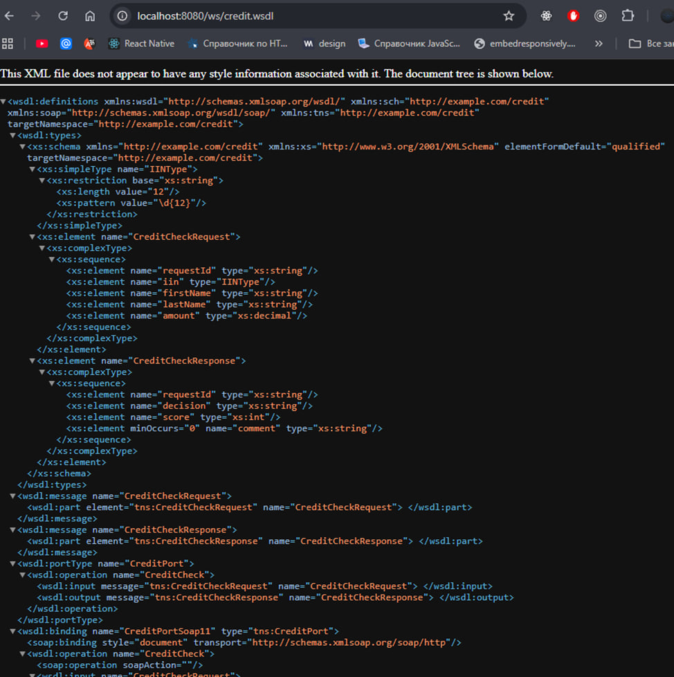
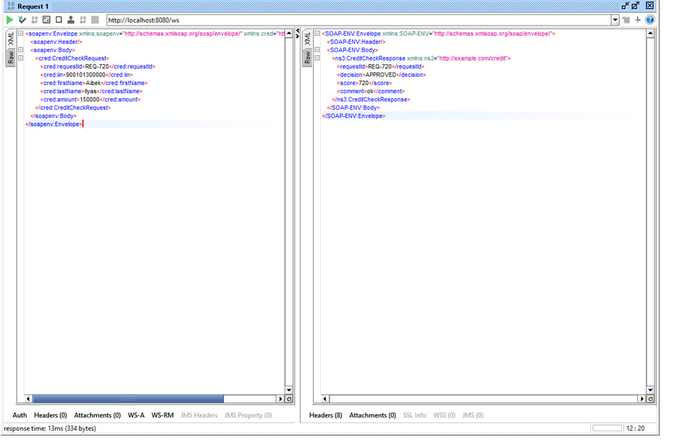
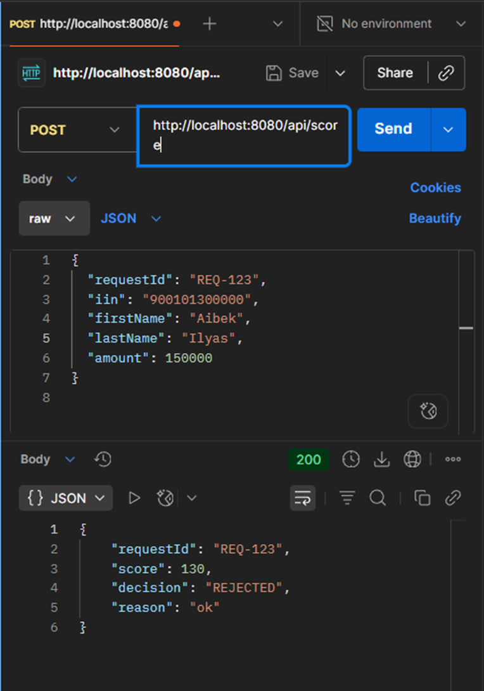

# soap-rest-credit-gateway
 мини-шлюз: SOAP-сервис принимает XML-запрос проверки клиента, валидирует его по XSD, дергает внешний REST-скоринг и возвращает SOAP-ответ

wsdl доступен по адресу http://localhost:8080/ws/credit.wsdl

SOAP запрос с положительным ответом, использую SOAP UI:

А также REST запрос с decision - reject, использую Postman

resources :
https://spring.io/guides/gs/producing-web-service
https://youtu.be/FYewIWrg6GI?si=Pyz59wYRuUSqClEv
https://youtu.be/xM67m9Bw2_o?si=5CX6Js_Vr2pLhR1m
https://youtu.be/Pz2jwZbDsNQ?si=DyB861mdqp9kjBNy
https://youtu.be/wm8CFbdysB4?si=2FLec20JQUKkeSTR
https://youtu.be/O6HgsvdshFA?si=Dq2I1lmZK7mkE7Ve+
